# Projeto Wordpress - AWS e Docker - PB Compass UOL 

## Descrição da atividade:

* Instalação e configuração do DOCKER ou CONTAINERD no host EC2;
* Deploy de uma aplicação Wordpress com: container de aplicação e RDS database MySql;
* Configuração da utilização do serviço EFS AWS para estáticos do container de aplicação Wordpress;
* Configuração do serviço de Load Balancer AWS para a aplicação Wordpress.

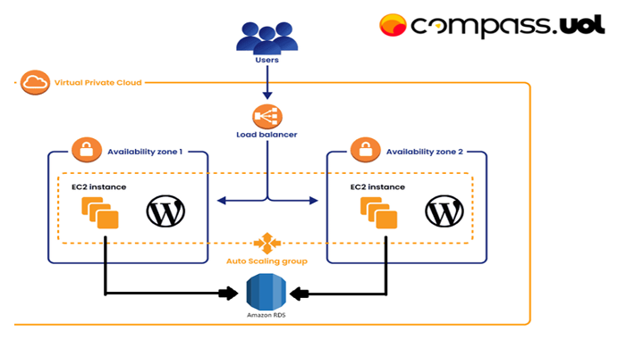
#

## Criação da VPC:

### Navegue no console da AWS até `VPC`, clique em `Create VPC` e siga as seguintes configurações:

* Escolha um nome para sua VPC;
* `IPv4 CIDR block`, `IPv6 CIDR block` e `Tenancy` pode manter os valores default;
* `Number of Availability Zones (AZs)`: 2;
* `Number of public subnets`: 2;
* `Number of private subnets` 2;
* `NAT gateways ($)`: None (o NAT gateway será criado posteriormente para fins de economia);
* `VPC endpoints`: None;
* `DNS options`: 
    - Enable DNS hostnames ✅
    - Enable DNS resolution ✅
* Ao finalizar, confira a prévia:
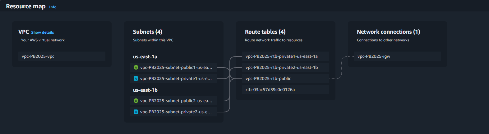
#
## Criação dos Security Groups:

### Navegue no console da AWS até `EC2` e no painel localizado na esquerda selecione `Security Groups`, clique em `Create Security Group`:

* Primeiro criamos o Security Group do nosso futuro `Application Load Balancer`. Na tela de criação selecione a VPC criada anteriormente e crie duas `Inbound rules`:

    | Type  | Protocol | Port Range | Source Type |  Source   |
    | ----- | -------- | ---------- | ----------- | --------- |
    | HTTPS |   TCP    |    443     |  Anywhere   | 0.0.0.0/0 |
    | HTTP  |   TCP    |    80      |  Anywhere   | 0.0.0.0/0 |

* Depois criamos o Security Group do nosso futuro `RDS`. Na tela de criação selecione a VPC criada anteriormente e crie a `Inbound rules`:

    |     Type     | Protocol | Port Range | Source Type |  Source   |
    | ------------ | -------- | ---------- | ----------- | --------- |
    | MySQL/Aurora |   TCP    |    3306    |   Custom    |   EC2 SG  |

* Em seguida criamos o Security Group do nosso futuro `EFS`. Na tela de criação selecione a VPC criada anteriormente e crie a `Inbound Rules`:

    |     Type     | Protocol | Port Range | Source Type |  Source   |
    | ------------ | -------- | ---------- | ----------- | --------- |
    |      NFS     |   TCP    |    2049    |   Custom    |   EC2 SG  |

> [!NOTE]
> Não será possível escolher o Security Group da EC2 como `Source` enquanto ele não for criado, então após sua criação faça os ajustes nos Security Groups anteriores.

* Por fim, criamos o Security Group destinado às `EC2`. Na tela de criação selecione a VPC criada anteriormente e crie as `Inbound rules`:

    |   Type     | Protocol | Port Range | Source Type |  Source   |
    | ---------- |--------- | ---------- | ----------- | --------- |
    | Custom TCP |   TCP    |   8080     |   Custom    |  ALB SG   |
    |    HTTP    |   TCP    |    80      |   Custom    |  ALB SG   |

> [!NOTE]
> Pode-se adicionar uma `inbound rule` para permitir SSH, para podermos acessar as EC2 e validar conexões.
#
## Criação do Relational Database (RDS):

### Navegue no console da AWS até `Aurora and RDS` e clique em `Create a database`:

* Em `Choose a database creation method` selecione `Standard create`;
* Escolha a opção de `MySQL` em `Engine options` e selecione o `Free tier` em `Templates`;
* Em `Settings` siga os seguintes passos:
  * Em `DB instance identifier` pode manter o nome default;
  * `Master username` você irá definir o nome que será o `WORDPRESS_DB_USER` em seu arquivo docker compose;
  * `Credentials management` mantenha o `Self managed`;
  * Em `Master password` você irá definir o nome que será o `WORDPRESS_DB_PASSWORD` em seu arquivo docker compose.
* Em `Instance configuration` selecione o database do tipo `db.t3.micro`;
* Na parte de `Connectivity` replique os seguintes passos:
  * Em `Compute resource` e `Storage`, pode manter os valores default;
  * Em seguida, selecione sua `VPC` e o `Security Group` destinado ao RDS;
  * Outras opções dessa etapa podem ser mantidas como default.
* Ao final da página, em `Additional configuration`, defina o `Initial database name`, que será o `WORDPRESS_DB_NAME` em seu arquivo docker compose.

> [!NOTE]
> Recomendo desmarcar a opção de `Backup` caso queria reduzir possíveis custos durante testes.

* Clique em `Create database` para finalizar e aguarde alguns minutos enquanto ela é provisionada;
* Para finalizar, clique no nome de sua database e confira o `Endpoint` na aba `Connectivity & Security`, ele será o `WORDPRESS_DB_HOST` em seu arquivo docker compose.
#
## Criação do File System (EFS):

### Navegue no console da AWS até `EFS` e clique em `Create File System`:

* Clique em `customize` e siga as etapas;
  * Primeira etapa (File system settings): 
    * Selecione `Regional` em `File System Type`;
    * Configurações restantes podem ficar as default;
  * Segunda etapa (Network access):
    * Selecione sua `VPC`;
    * Selecione as `private subnets` de sua `VPC` e escolha o `Security Group` criado anteriomente para o `EFS`;
  * A terceira etapa é opcional;
  * Para finalizar, revisamos nosso `EFS` na quarta etapa e clicamos em `Create`
  * Após a criação, confira o `File System ID`, que será utilizado em seu `User Data`.

> [!TIP]
> Quando sua EC2 estiver rodando, podemos conferir se a montagem foi feita corretamente nos conectando à instância via `Instance Connect` e rodando o comando `df -h`.
>
> 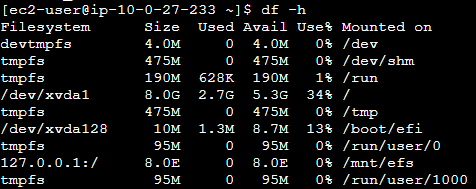
#
## Criação da EC2:

* Nossa instância EC2 não será criada manualmente, ela será configurada posteriormente durante a criação de um `Launch Template` para o nosso `Auto Scalling Group`.
#
## Criação do Target Group:

### Navegue no console da AWS até `EC2` e selecione, no menu lateral esquerdo a opção `Target Groups` (também é possível pesquisar diretamente, sem precisar passar pela página da EC2) e clique em `Create target group`:

* Em `Basic Configurations` siga as seguintes instruções:
  * Tipo de `target group`: `Instances`;
  * Dê um nome;
  * Para `Protocol` e `Port` mantenha os valores respectivos de `HTTP` e `80`;
  * Selecione sua VPC e mantenha os valores default das opções restantes;
* Em `Health Check` configure da seguinte forma:
  * `Health check protocol`: `HTTP`;
  * `Health check path`: `/`;
  * Expanda a aba de `Advanced health check settings` e coloque as configurações da imagem:
  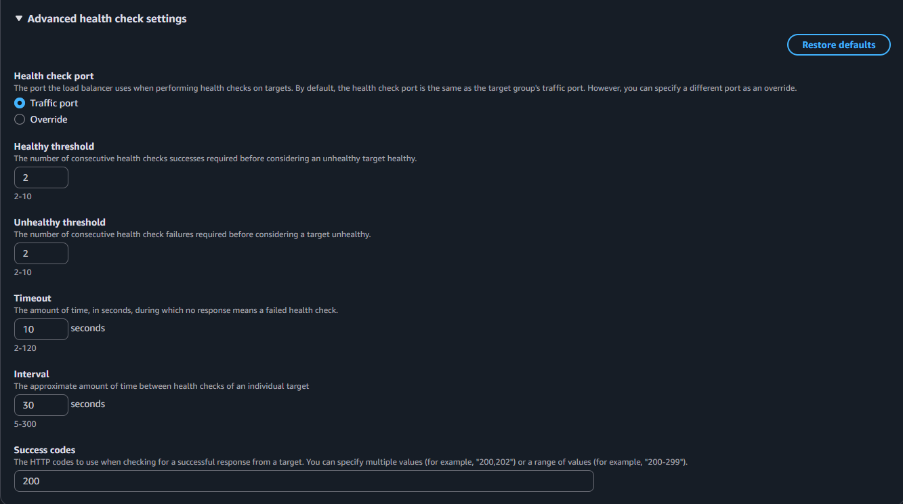
* Clique em `Next` e em seguinda em `Create target group`.
#
## Criação do Load Balancer:

### Retorne à página da `EC2` e, no menu lateral esquerdo, selecione `Load Balancers` e então clique em `Create load balancer`:

* Clique em `Create` na opção `Application Load Balancer`;
* Em `Basic configuration` replique o que seguinte:
  * Defina um nome;
  * Em `Scheme` selecione `Internet-facing`;
  * Em `Load balancer IP address type` selecione `IPv4`;
* Em `Network mapping` selecione sua VPC, marquei a checkbox de ambas `AZs` e selecione a subnet pública de cada, resultando em algo do tipo:
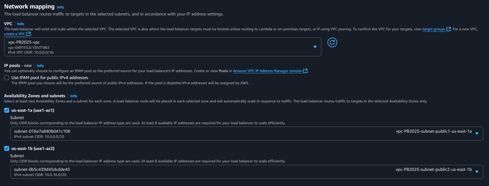
* Em `Security Groups` remova o default e adicione o que foi criado especificamente para o nosso `Load Balancer`;
* Em `Listeners and routing` mantenha o procolo `HTTP` e a porta `80`, e selecione o `Target Group` criado na etapa anterior;
* Finalize clicando em `Create load balancer`.
#
## Criação do Auto Scalling Group (ASG):

### Retorne à página da `EC2` e, no menu lateral esquerdo, selecione `Auto Scalling Groups` e clique em `Create Auto Scalling Group`:

* Nesta primeira etapa, dê um nome para seu `Auto Scalling Group`;
* Em `Launch Template` selecione a opção para criar um novo (será aberto em uma aba nova);

#### Criação do Launch Template:

* Aqui basicamente será feita a configuração de nossas EC2s;
* Dê um nome e uma versão para seu `Launch Template`;
* Em `Launch template contents`, para o Sistema Operacional, clique em `Quick start` e selecione `Amazon Linux` (por default virá a versão 2023 que é gratuita);
* Em `Instance type` selecione a `t2.micro`;
* Para `Key pair` pode manter a opção `Don't include in launch template`;
* Em `Network settings` não há necessidade de seleções no momento, a escolha de `subnet` e `Security group` pode ser feita posteriormente durante a criação do `Auto Scalling Group`, mas caso queira, pode-se selecionar logo o `Security Group`;
* Em `Storage` pode-se manter o default;

> [!NOTE]
> Para o Programa de Bolsas, é necessário adicionar tags específicas em `Resource Tags`.

* Clique para expandir a aba de `Advanced details`, desça até o final da página e localize o campo para inserção do `User data` e insira os comandos desejados;

> [!NOTE]
> User data utilizado [aqui](https://github.com/PedroMak/WordpressDeployOnAWSWithDocker/blob/master/userdata.sh).

* Clique em `Create launch template`.

#### De volta à criação do Auto Scalling Group:

* Com o nome já definido, selecione o `Launch Template` que foi criado e clique em `Next`;
* Na segunda etapa, em `Network`, selecione sua VPC, as duas subnets públicas e pode manter `Balanced best effort`. Clique em `Next`;
* Para a terceira etapa, siga as seguintes configurações:
  * Selecione `Attach to an existing load balancer` em `Load balancing`;
  * Selecione `Choose from your load balancer target groups` e escolha o `Target Group` que foi criado;
  * Para `VPC Lattice integration options` pode manter `No VPC Lattice service`;
  * Em `Health Checks` marque o checkbox de `Turn on Elastic Load Balancing health checks` conforme a imagem:
  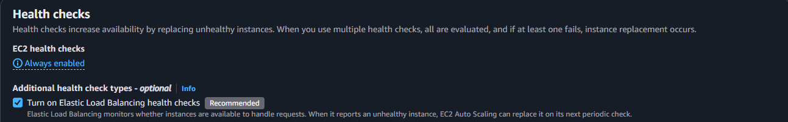
* Na quarta etapa definimos as seguintes condigurações:
  * `Desired capacity`: 2;
  * `Min desired capacity`: 2;
  * `Max desired capacity`: 4;
  * Em `Automatic scalling` selecionamos `Target tracking scaling policy` e editamos as seguintes configurações:
    * Dê um nome para sua política;
    * Defina a métrica como `Application Load Balancer request count per target`;
    * Selecione seu `Target Group`;
    * `Target value`: 6;
    * `Instance warmup`: 300;
    * As configurações restantes podem ser mantidas como default, então clique em `Next`;

    >[!NOTE]
    > É possível criar uma política de escalonamento mais robusta e com alarmes via `CloudWatch`.
* A quinta e sexta etapas são opcionais, clique em `Next` nas duas, mas antes de clicar em `Create Auto Scalling Group` precisamos criar o `NAT Gateway`;

#### Criação do NAT Gateway:

* Navegue no console da AWS até `VPC` e, no menu lateral esquerdo, selecione `NAT gateways` e então clique em `Create NAT gateway`;
* Dê um nome e selecione a subnet pública a qual o NAT será associado;
* Em `Connectivity type` mantenha `Public`;
* Para seu IP elástico, selecione a opção `Allocate Elastic IP`;
* Em seguida, no menu lateral, selecione `Route Tables`;
* Localize a `Route Table` referente à subnet privada, entre na route table e, na aba `Routes` clique em editar;
* Clique em `Add route` e:
  * Em `Destination` coloque `0.0.0.0/0`;
  * Em `Target` coloque `NAT Gateway` e selecione o que foi criado anteriormente conforme a imagem:
  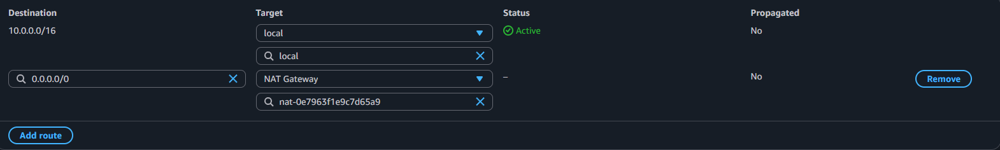
* Clique em `Save changes` e repita o processo, criando um segundo `NAT Gateway` para a segunda subnet.

#### De volta a tela de criação do Auto Scalling Group:

* Clique em `Create Auto Scalling Group`.
#
## Testes e Validações:

* Após criar o `Auto Scalling Group` as instâncias `EC2` serão lançadas automaticamente e, após terminarem de iniciar, podemos acessar nosso conteúdo via DNS do `Load Balancer`:
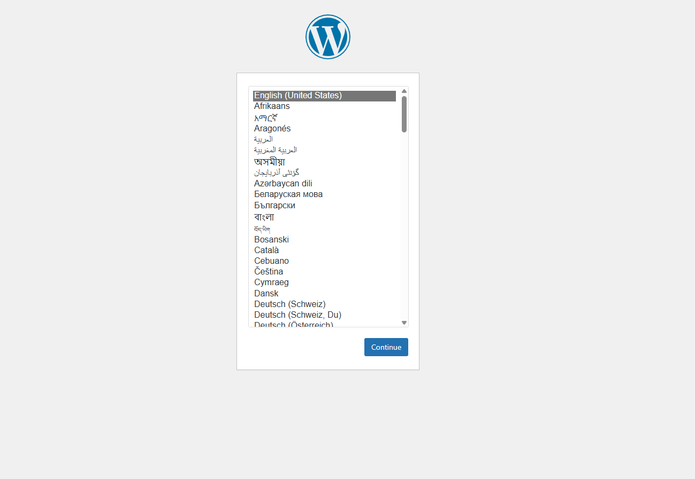

* Após escolher o idioma deverá ser realizada a isntalação do Wordpress, nomeando o site e criando um usuário e senha atrelado a um email;
* Depois de instalar e realizar o login estaremos diante do site no ar:
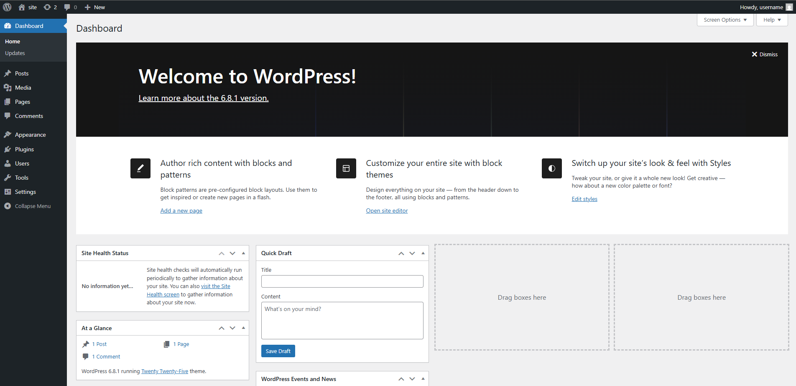

* Com isso nosso projeto estaria pronto, porém se formos até o nosso `Target Group` e visualizarmos a aba `Targets` iremos notar que, mesmo conseguindo acessar o site pelo DNS do `Load Balancer`, eles se encontram `Unhealthy`:
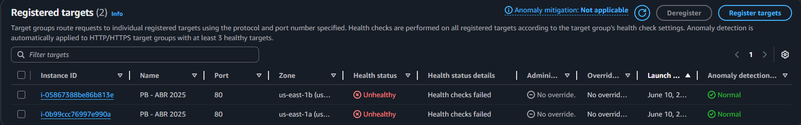

* Isso se deve a um comportamento do Wordpress onde o caminho `/` nos retorna um `Status Code 302`, ou seja, ele nos redireciona para uma nova URL. Tal efeito gera discussões em fóruns, como o [serverfault](https://serverfault.com/questions/826719/how-to-create-a-url-in-a-wordpress-that-will-return-code-200), onde os usuários buscam formas de "driblar" esse comportamento. Uma das formas citadas é alterar o caminho onde o `Health Check` é realizado de `/` para `/wp-admin/images/wordpress-logo.svg` que, quando o site está no ar, sempre retorna `Status Code 200`;

* Uma segunda forma, mas não tão agradável seria adicionar o código `302` em `Success codes` de nosso `Health Check`;

* Uma terceira forma, e a mais elegante, é utilizar o plugin [Health Endpoint](https://github.com/jonotaegi/wordpress-health-endpoint), desenvolvido pela comunidade, onde o plugin cria um endpoint `/health` que testa a conexão com o banco de dados e retorna `200 OK` enquanto a página estiver saudável;
  * Para instalar o plugin, selecionei a opção `Plugins` no menu lateral esquerdo;
  * Em seguida cliquei em `Add plugin` e pesquisei pelo nome `Health Endpoint` e cliquei em `Install Now`: 
  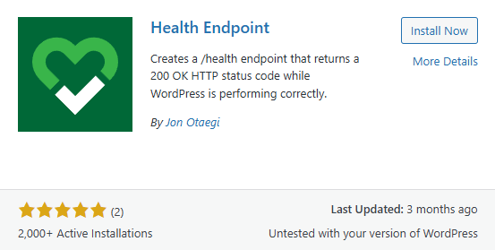
  * Após a instalação, clique em `Activate`.

* Com o plugin instalado, podemos conferir novamente a aba `Target` e veremos que eles agora se encontram `Healthy`:
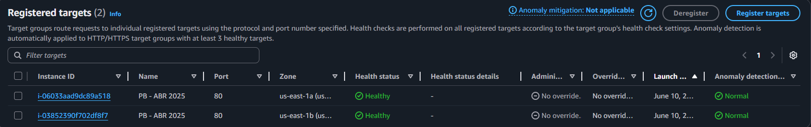